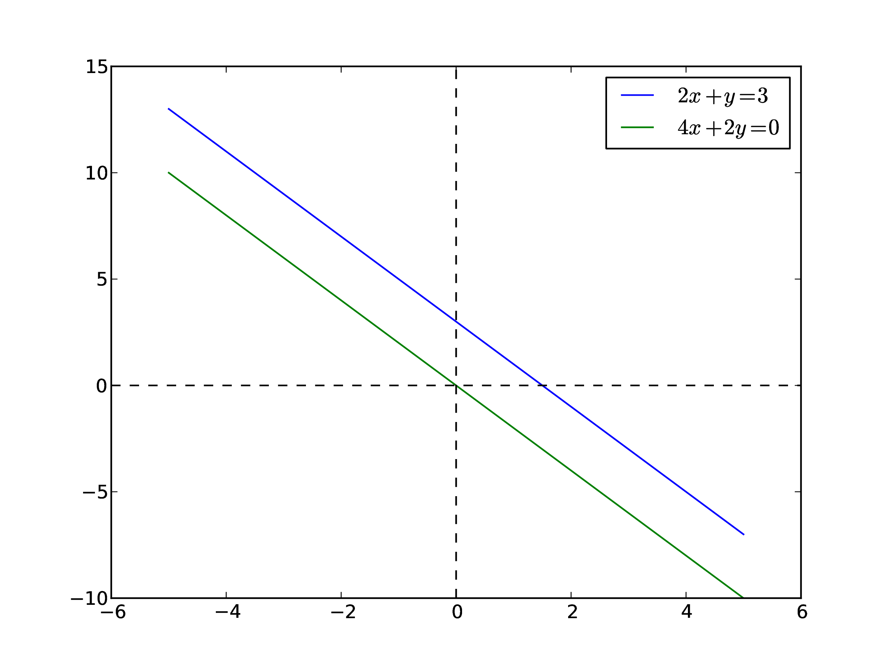

# Métodos numéricos para matrices.

# Introducción.

## Primer ejemplo: Vibraciones en una molécula.

Supongamos que queremos estudiar el espectro de vibraciones de una molécula con $n$ grados de libertad. La primera aproximación consiste en investigar las oscilaciones armónicas del sistema, expandiendo la energía potencial hasta el segundo orden en las coordenadas generalizadas alrededor de las posiciones de equilibrio:
$$
\begin{align*}
U (q_1, q_2, \ldots, q_n) \simeq \dfrac{1}{2} \sum_{i, j = 1} A_{ij} \: q_i \: q_j
\end{align*}
$$
donde las $q_i$ son las coordenadas generalizadas y $A_{ij}$ son parámetros del potencial que usualmente pueden obtenerse a partir de un cálculo de química cuántica.

La energía cinética puede escribirse en términos de las velocidades generalizadas:
$$
\begin{align*}
T (\dot{q_1}, \dot{q_2}, \ldots, \dot{q_n}) \simeq \dfrac{1}{2} \sum_{i, j=1} M_{ij} \: \dot{q_i} \: \dot{q_j}
\end{align*}
$$
donde las $\dot{q}_i = d q_i/dt$ son las velocidades generalizadas, las $M_{ij}$ son los elementos de masa generalizado en la matriz, cuyos valores dependen en particular de la molécula.

Aplicando la ecuación de Lagrange:
$$
\begin{align*}
\dfrac{\partial \mathcal{L}}{\partial q_i} - \dfrac{d}{dt} \: \dfrac{\partial \mathcal{L}}{\partial \dot{q_i}} = 0
\end{align*}
$$
donde el lagrangiano del sistema es: $\mathcal{L} = T - U$, por tanto, tenemos que:
$$
\begin{align*}
\sum_{j = 1}^{n} \left( A_{ij} \: q_{j} + M_{ij} \: \ddot{q_{j}} \right) = 0, \hspace{1cm} i = 1, 2, \ldots, n
\end{align*}
$$

Si suponemos que la dependencia del tiempo en las coordenadas generalizadas es de tipo oscilatorio, con:
$$
\begin{align*}
q_{j} = x_{j} \: e^{-i \omega t}
\end{align*}
$$
Se obtiene el siguiente sistema de ecuaciones homogéneo:
$$
\begin{align*}
\sum_{j = 1}^{n} \left( A_{ij} -  \omega^{2} \: M_{ij} \right) x_{j} = 0, \hspace{1cm} i = 1, 2, \ldots, n
\end{align*}
$$

La ecuación anterior se puede reescribir en forma matricial, como:
$$
\begin{align*}
\begin{pmatrix}
A_{11} & \ldots & A_{1n} \\
\vdots & \vdots & \vdots \\
A_{n1} & \ldots & A_{nn}
\end{pmatrix}
\begin{pmatrix}
x_{1} \\
\vdots \\
x_{n}
\end{pmatrix} = \lambda
\begin{pmatrix}
M_{11} & \ldots & M_{1n} \\
\vdots & \vdots & \vdots \\
M_{n1} & \ldots & M_{nn}
\end{pmatrix}
\begin{pmatrix}
x_{1} \\
\vdots \\
x_{n}
\end{pmatrix}
\end{align*}
$$

De manera equivalente:
$$
\begin{align*}
\mathbf{A \: x} = \lambda \: \mathbf{M \: x}
\end{align*}
$$
donde $\lambda= \omega^{2}$ es el valor propio y $\mathbf{x}$ es el correspondiente vector propio de la ecuación de valores propios.

Este es un sistema de ecuaciones lineales homogéneas; con el fin de contar con una solución **no trivial** del conjunto de ecuaciones, el determinante de la matriz de coeficientes debe anularse, esto es:
$$
\begin{align*}
det \vert \mathbf{A} - \lambda \: \mathbf{M} \vert = 0 
\end{align*}
$$

Las raíces de esta ecuación $\lambda_{k}$ con $k = 1, 2, \ldots, n$ proporcionan todas las frecuencias angulares vibracionales de la molécula:
$$
\begin{align*}
\omega_{k} = \sqrt{\lambda_{k}}
\end{align*}
$$

## Segundo ejemplo: Circuito eléctrico.

Consideremos el siguiente circuito eléctrico:

Podemos aplicar las leyes de Kirchhoff para obtener un conjunto de ecuaciones que relacionan los voltajes y las corrientes del circuito, luego entonces, resolverlo y encontrar las incógnitas.

Pero ahora veamos el caso del puente desbalanceado de Wheastone: tenemos tres circuitos (o mallas) independientes:

$$
\begin{align*}
r_{s} \: i_{1} + r_{1} \: i_{2} + r_{2} \: i_{3} = v_{0}
\end{align*}
$$

$$
\begin{align*}
-r_{x} \: i_{1} + ( r_{1} + r_{x} + r_{a}) \: i_{2} + r_{a} \: i_{3} = 0
\end{align*}
$$

$$
\begin{align*}
-r_{3} \: i_{1} - r_{a} \: i_{2} + ( r_{2} + r_{3} + r_{a}) \: i_{3} = 0
\end{align*}
$$

Entonces el sistema de ecuaciones resulta ser:
$$
\begin{align*}
r_{s} \: i_{1} + r_{1} \: i_{2} + r_{2} \: i_{3} &= v_{0} \\
-r_{x} \: i_{1} + (r_{1} + r_{x} + r_{a}) \: i_{2} + r_{a} \: i_{3} &= 0 \\
-r_{3} \: i_{1} - r_{a} \: i_{2} + (r_{2} + r_{3} + r_{a}) \: i_{3} &= 0
\end{align*}
$$

El sistema anterior se puede escribir como:
$$
\begin{align*}
\mathbf{R \: i} = \mathbf{v}
\end{align*}
$$

donde la matriz de coeficientes de las resistencias es
$$
\begin{align*}
\mathbf{R} =
\begin{pmatrix}
r_{s} & r_{1} & r_{2} \\
-r_{x} & r_{1} + r_{x} + r_{a} & -r_{a} \\
-r_{3} & -r_{a} & r_{2} + r_{3} + r_{a}
\end{pmatrix}
\end{align*}
$$

Los vectores columna de corrientes y voltajes son:
$$
\begin{align*}
\mathbf{i} =
\begin{pmatrix}
i_{1} \\
i_{2} \\
i_{3}
\end{pmatrix}
\hspace{2cm}
\mathbf{v} =
\begin{pmatrix}
v_{0} \\
0 \\
0
\end{pmatrix}
\end{align*}
$$

Multiplicando en ambos lados por $\mathbf{R}^{-1}$ (la matriz inversa de $\mathbf{R}$), la ecuación:
$$
\begin{align*}
\mathbf{Ri} = \mathbf{v}
\end{align*}
$$
resulta:
$$
\begin{align*}
\mathbf{i} = \mathbf{R}^{-1}\mathbf{v}
\end{align*}
$$

pero se requiere que conozcamos $\mathbf{R}^{-1}$.

¿Será necesario conocer siempre la matriz inversa?

# Sistemas lineales algebraicos.

En este tema analizamos la solución de sistemas de ecuaciones lineales algebraicos, con $n$ incógnitas. 

Cuando tomamos un problema físico, los conjuntos de ecuaciones a menudo son muy grandes, por lo que consumen una gran cantidad de recursos computacionales.
\end{frame}

## Uso de propiedades de la matriz.

Por lo general, se reducen los requerimientos de almacenamiento y el tiempo de ejecución aprovechando algunas propiedades especiales de la matriz de coeficientes, tales como poca densidad (la mayoría de los elementos de un matriz dispersa son cero -las llamadas matrices **sparse**-).

## Algoritmos de solución.

Existen muchos algoritmos dedicados a la solución de grandes conjuntos de ecuaciones, cada uno de ellos está adaptado a una determinada forma de la matriz de coeficientes (simétrica, 
en bandas, escasa, etc.)

## Librerías de algoritmos.

En internet se encuentran disponibles librerías para resolver cierto tipo de problemas, al usarlas se requiere conocer la manera en que se proporcionan los argumentos y las variables de resultado que proporcionan, se obliga la revisión de la documentación de cada uno de los códigos.

Hay varios paquetes de software centrales para álgebra lineal y problemas de valores propios. Varios de los más populares han sido incluidos en otros paquetes de software como los del texto ampliamente utilizado **Numerical Recipes**. Los códigos fuente originales en muchos de los paquetes disponibles a menudo se toman del paquete de software ampliamente utilizado LAPACK, que sigue a otros dos paquetes populares desarrollados en la década de 1970, a saber, EISPACK y LINPACK. Los describimos brevemente aquí.

1. LINPACK: paquete para ecuaciones lineales y problemas de mínimos cuadrados.

2. LAPACK: paquete para resolver problemas de valores propios simétricos, asimétricos y generalizados. Desde el sitio web de LAPACK [(liga aquí)](http://www.netlib.org) es posible descargar de forma gratuita todos los códigos fuente de esta biblioteca. Ambas versiones C/C++ y Fortran están disponibles.

3. BLAS (I, II y III): (Subprogramas básicos de álgebra lineal) son rutinas que proporcionan bloques de construcción estándar para realizar operaciones básicas con vectores y matrices. Blas I es operaciones vectoriales, II operaciones vector-matriz y III operaciones matriz-matriz. Códigos altamente paralelizados y eficientes, todos disponibles para descargar desde [acá](http://www.netlib.org).

## Sistema algebraico.

Un sistema algebraico tiene la forma:
$$
\begin{align*}
A_{11} x_{1} + A_{12} x_{2} + \ldots + A_{1n} x_{n} &= b_{1} \\
A_{21} x_{1} + A_{22} x_{2} + \ldots + A_{2n} x_{n} &= b_{2} \\
\vdots \hspace{2cm} &= \vdots \\
A_{n1} x_{1} + A_{n2} x_{2} + \ldots + A_{nn} x_{n} &= b_{n} \\
\end{align*}
$$
o sencillamente:
$$
\begin{align*}
\mathbf{A \: x} = \mathbf{b}
\end{align*}
$$

Una representación particularmente útil de las ecuaciones para los propósitos computacionales es la **matriz de coeficientes aumentada**, que se obtiene al juntar el vector constante $\mathbf{b}$ a la matriz de coeficientes $\mathbf{A}$ de la siguiente manera:
$$
\begin{align*}
\left[ A \vert b \right] = 
\left(
\begin{array}{c c c c | c} 
A_{11} & A_{12} & \ldots & A_{1n} & b_{1} \\
A_{21} & A_{22} & \ldots & A_{2n} & b_{2} \\
\vdots & \vdots & \ddots & \vdots & \vdots \\
A_{n1} & A_{n2} & \ldots & A_{nn} & b_{n} \\
\end{array}
\right)
\end{align*} 
$$

# Unicidad de la solución.

Un sistema de $n$ ecuaciones lineales con $n$ incógnitas tiene una solución única, siempre que el determinante de la matriz de coeficientes sea <b>no singular</b>, es decir, $\vert A \vert = 0$.

Las filas y columnas de una matriz no singular son linealmente independientes en el sentido de que no hay ninguna fila (o columna) que sea una combinación lineal de las otras filas (o columnas)

Si la matriz de coeficientes es singular, las ecuaciones pueden tener un número infinito de soluciones o no soluciones en absoluto, dependiendo del vector constante.

## Caso 1: Soluciones infinitas.

Como ejemplo veamos las ecuaciones:
$$
\begin{align*}
2 \, x + y &= 3 \\
4 \, x + 2 \, y &= 6
\end{align*}
$$

La segunda ecuación puede obtenerse multiplicando la primera ecuación por dos.

Cualquier combinación de $x$ e $y$ que satisface la primera ecuación es también una solución de la segunda. El número de tales combinaciones es infinito.

## Caso 2: Sistemas sin solución.

En otro caso, las ecuaciones:
$$
\begin{align*}
2 \: x + y &= 3 \\
4 \: x + 2 \:y &= 0
\end{align*}
$$

No tienen solución, ya que la ecuación equivalente $2 \: x + y = 0$, contradice la primera. Por tanto, cualquier solución que satisface la primera, no puede satisfacer la segunda.

# Problemas mal condicionados.

Una pregunta obvia es: **¿qué sucede cuando la matriz de coeficientes es casi singular?** es decir, si $\vert A \vert$ es muy pequeño?

Con el fin de concluir si el determinante de la matriz es pequeño, necesitamos una referencia contra la cual el  determinante se pueda medir.

## Norma de una matriz.

Esta referencia se denomina la <b>norma</b> de la matriz y se denota por $\parallel A \parallel$.

Entonces podemos decir que el determinante es pequeño si:
$$
\begin{align*}
\vert A \vert << \parallel A \parallel
\end{align*}
$$

Existen diferentes maneras de calcular la norma de una matriz, tales como:
$$
\begin{align*}
\parallel A \parallel =& \sqrt{\sum_{i = 1}^{n} \: \sum_{j = 1}^{n} \:  A^{2}_{ij}} \\
\parallel A \parallel =& \max\limits_{1 \leq i \leq j} \sum_{j=1}^{n} \: \vert A_{ij} \vert
\end{align*}
$$

## Número de condición de la matriz.

Una medida formal de condicionamiento está dada por el <b>número de condición</b> de la matriz, definido por:
$$
\begin{align*}
\mbox{cond}(A) = \parallel A \parallel \parallel A^{-1} \parallel
\end{\align*}
$$

Si este número es cercano a la unidad, la matriz está bien condicionada.

El número de condición aumenta con el grado de mal acondicionamiento, tendiendo a infinito para una matriz singular. Toma en cuenta que el número de condición no es único, sino que depende de la elección de la norma de la matriz.

Desafortunadamente, el número de condición es costoso de calcular para grandes matrices. En la mayoría de los casos es suficiente para medir el condicionamiento comparando el determinante con las magnitudes de los elementos en la matriz.

## Efectos del mal condicionamiento.

Si las ecuaciones están mal condicionadas, pequeños cambios en la matriz de coeficientes dan como resultado grandes cambios en la solución.

A modo de ejemplo, consideremos las ecuaciones:
$$
\begin{align*}
2 \: x + y &= 3 \\
2 \: x + 1.001 \:y &= 0
\end{align*}
$$
que tiene la solución $x = 1501.5$, $y = -3000$.

Dado que :
$$
\begin{align*}
\vert A \vert = 2 \: (1.001) - 2 \: (1) = 0.002
\end{align*}
$$

es mucho menor que los coeficientes, las ecuaciones están mal condicionadas.

Usemos arreglos y las funciones de python para explorar este sistema.

# Representación de las matrices.

El sistema de ecuaciones algebraicas:
$$
\begin{align*}
2 \: x + y &= 3 \\
2 \: x + 1.001 \:y &= 0
\end{align*}
$$

Se va a representar de la siguiente forma:

$$
\begin{align*}
\mathbf{A} = \begin{pmatrix}
2 & 1 \\
2 & 1.001
\end{pmatrix}
\hspace{2cm}
\mathbf{b} = \begin{pmatrix}
3 \\
0
\end{pmatrix}
\end{align*}
$$

## El objeto <code>array</code>.

El objeto que debemos de utilizar es el objeto <code>array</code>, ya que es la manera con la que podremos aprovechar las funciones de python.

Nótese que la manera en que se ingresan los elementos del arreglo en python, es por renglones, en otros lenguajes de programación o programas, los elementos se pueden ingresar por columnas, siendo necesario revisar la documentación respectiva.

$$
\begin{align*}
\mathbf{A} = \begin{pmatrix}
2 & 1 \\
2 & 1.001
\end{pmatrix}
\hspace{1cm}
\rightarrow
\hspace{1cm}
A = \text{array}([[2., 1.], [2, 1.001]])
\end{align*}
$$

## Funciones en <code>numpy.linalg</code>.

En el módulo <code>numpy.linalg</code> se tiene un conjunto de librerías y funciones útiles para las operaciones entre arreglos (podemos expresar el término *matrices* sin caer en complicaciones), entre otras podemos mencionar:

1. <code>dot(a, b)</code>: Producto punto de dos arreglos.
2. <code>vdot(a, b)</code>: Producto punto de dos vectores.
3. <code>norm(x)</code>: La norma de un arreglo o vector.
4. <code>cond(x)</code>: Calcula el número de condición de una matriz.
5. <code>det(x)</code>: Calcula el determinante de un arreglo.
6. <code>matrix_rank(M)</code>: Devuelve el rango de un arreglo.
7. <code>trace(a)</code>: Devuelve la suma a lo largo de la(s) diagonal(es) de un arreglo.
8. <code>solve(1, b)</code>: Resuelve una ecuación matricial lineal o un sistema de ecuaciones escalares.
9. <code>inv(a)</code>: Calcula la inversa de una matriz.

# Haciendo algunas operaciones.

## Calculando el determinante.

import numpy as np

a = np.array([[2., 1.], [2, 1.001]])
b = np.array([3., 0.])

print(np.linalg.det(a))

## Número de condición.

Ahora calculamos el valor del número de condición	

print(np.linalg.cond(a))

## Solución del sistema.

Resolvemos el sistema algebraico:

np.linalg.solve(a,b))

## Condición del sistema.

El efecto de los malos acondicionamientos se puede verificar mediante un cambio en la segunda ecuación:

$$
\begin{align*}
2 \, x + y &= 3 \\
2 \, x + 1.002 \, y &= 0
\end{align*}
$$

Creamos un nuevo arreglo $c$:

c = np.array([[2.,1.],[2.,1.002]])

Calculamos el número de condición:

print(np.linalg.cond(c))

Resolvemos el sistema: usando la función <code>solve(a, b)</code>, resolvemos el sistema:

print(np.linalg.solve(c,b))

**Un pequeño cambio provoca un enorme impacto:** Nótese que un cambio del $0.1\%$ en el coeficiente de $y$ produce un cambio de $100\%$ en la solución!

# Sistemas algebraicos lineales.

Las ecuaciones algebraicas lineales, se presentan en casi todas las ramas del análisis numérico. Su aplicación más visible es en el análisis de sistemas lineales: cualquier sistema cuya respuesta es proporcional a la entrada se considera que es lineal.

Los sistemas lineales incluyen estructuras, sólidos, elásticos, flujo de calor, filtraciones de líquidos, campos electromagnéticos, los circuitos eléctricos, etc. 

Si el sistema es discreto, tal como una viga o un circuito eléctrico, entonces su análisis conduce directamente a ecuaciones algebraicas lineales.

## Sistemas algebraicos discretos.

Si el sistema es discreto, como en los esfuerzos en una viga o circuito eléctrico, entonces su análisis conduce directamente a ecuaciones algebraicas lineales. En el caso de una viga estática, por ejemplo, las ecuaciones surgen cuando se describen las condiciones de equilibrio de los soportes.

Las incógnitas $x_{1}, x_{2}, \ldots, x_{n}$ representas las fuerzas en las uniones y las reacciones de soporte, mientras que las constantes $b_{1}, b_{2}, \ldots, b_{n}$ son las cargas externas.    

El comportamiento de los sistemas continuos se describen por ecuaciones diferenciales, en lugar de ecuaciones algebraicas. Sin embargo, como el análisis numérico sólo puede ocuparse de variables discretas, es primero necesario aproximar una ecuación diferencial con un sistema de ecuaciones algebraicas.

## Métodos conocidos de solución.

Son conocidos los métodos de diferencias finitas, elementos finitos para el análisis y solución. Estos métodos utilizan diferentes aproximaciones para conseguir una **discretización**, pero en cada caso la tarea final es el mismo: resolver un sistema (a menudo un sistema muy grande) de ecuaciones lineales algebraicas.

## Expresiones de los sistemas algebraicos.

El modelado de sistemas lineales invariablemente da lugar a las ecuaciones de la forma $\mathbf{A \:x} = \mathbf{b}$, donde $\mathbf{b}$ es la entrada y $\mathbf{x}$ representa la respuesta del sistema.

El coeficiente de la matriz $\mathbf{A}$, refleja las características del sistema, es independiente de la entrada. En otras palabras, si se cambia la entrada, las ecuaciones tienen que ser resueltas de nuevo con una $\mathbf{b}$ diferente, pero el mismo $\mathbf{A}$. Por lo tanto, es deseable tener un algoritmo que resuelva a ecuación la solución de algoritmo que puede gestionar cualquier número de vectores constantes con un mínimo esfuerzo computacional.

## Métodos de solución.

Hay dos clases de métodos para resolver sistemas de ecuaciones lineales algebraicas:
1. Métodos directos.
2. Métodos indirectos.

### Métodos directos.

La característica común de los métodos directos es que transforman las ecuaciones originales en ecuaciones equivalentes (ecuaciones que tienen la misma solución) que se pueden resolver más fácilmente.

### Operaciones elementales.

La transformación se lleva a cabo por la aplicación de las tres operaciones citadas a continuación. Estas **operaciones elementales** no cambian la solución, pero pueden afectar el determinante de la matriz de coeficientes como se indica en el paréntesis.

1. Intercambiar dos ecuaciones (cambia el signo de $\vert A \vert$).
2. Multiplicar una ecuación por una constante distinta de cero (se multiplica $\vert A \vert$ por la misma constante).
3. Multiplicar una ecuación por una constante distinta de cero y luego restarlo de otra ecuación (deja a $\vert A \vert$ sin cambios).

## Métodos indirectos.

Los métodos iterativos, o métodos indirectos, comienzan con una suposición de la solución $x$, y luego repetidamente refinan la solución hasta alcanzar un criterio de convergencia. Los métodos iterativos son generalmente menos eficientes que sus homólogos directos debido al gran número de iteraciones necesarias.

Pero sí tienen ventajas computacionales importantes si la matriz de coeficientes es muy grande y escasamente pobladas (la mayoría de los coeficientes son cero).

# Tres métodos directos.

A continuación se enumeran los tres métodos directos más usados, cada uno de los cuales utiliza operaciones elementales para producir su propia manera de resolver ecuaciones.

| Método                   | Forma inicial | Forma final       |
|--------------------------|---------------|-------------------|
| Eliminación de Gauss     | $A \: x = b$  | $U \: x = c$      |
| Descomposición LU        | $A \: x = b$  | $L \: U \: x = b$ |
| Eliminación Gauss-Jordan | $A \: x = b$  | $I \: x = c$      |

Donde $\mathbf{U}$ representa una matriz triangular superior, $\mathbf{L}$ es una matriz triangular inferior e $\mathbf{I}$ es la matriz identidad. 

Una matriz cuadrada se llama triangular si contiene sólo elementos cero en un lado de la diagonal principal.

Una matriz triangular superior $\mathbf{U}$ de $3 \times 3$  tiene la forma:
$$
\begin{align*}
\mathbf{U} = \begin{bmatrix}
U_{11} & U_{12} & U_{13} \\
0 & U_{22} & U_{23} \\
0 & 0 & U_{33}
\end{bmatrix}
\end{align*}
$$

Mientras que una matriz triangular inferior $\mathbf{L}$ de $3 \times 3$ es del tipo:
$$
\begin{align*}
\mathbf{L} = \begin{bmatrix}
L_{11} & 0 & 0 \\
L_{21} & L_{22} & 0 \\
L_{31} & L_{32} & L_{33}
\end{bmatrix}
\end{align*}
$$

## Matrices triangulares.

Las matrices triangulares juegan un papel importante en el álgebra lineal, ya que simplifican muchos cálculos. Por ejemplo, consideremos la ecuación $\mathbf{L \: x} = \mathbf{c}$:
$$
\begin{align*}
L_{11} \: x_{1} =& c_{1} \\
L_{21} \: x_{1} + L_{22} \: x_{2} =& c_{2} \\
L_{31} \: x_{1} + L_{32} \: x_{2} + L_{33} \: x_{3} =& c_{3} \\
\vdots
\end{align*}
$$

Si se resuelven las ecuaciones hacia delante, comenzando con la primera ecuación, los cálculos son muy fáciles, ya que cada ecuación contiene sólo una incógnita a la vez.

## Sustitución hacia adelante.

La solución se obtiene haciendo:
$$
\begin{align*}
x_{1} &= \dfrac{c_{1}}{L_{11}} \\
x_{2} &= \dfrac{(c_{2} - L_{21} \: x_{1})}{L_{22}} \\
x_{3} &= \dfrac{(c_{3} - L_{31} \: x_{1} - L_{32} \: x_{2})}{L_{33}} \\
\ldots
\end{align*}
$$

Este procedimiento se conoce como **sustitución hacia adelante**.

## Sustitución hacia atrás.

De una manera similar la operación $$\mathbf{U \: x} = \mathbf{c}$, se encuentra en el proceso de eliminación de Gauss, y puede resolverse fácilmente por sustitución hacia atrás, que se inicia con la última ecuación y va retrocediendo a través de las ecuaciones.

Las ecuaciones $\mathbf{L \: U} = \mathbf{b}$, que están asociadas con la descomposición $\mathbf{L \: U}$, también pueden resolverse rápidamente si las sustituimos con dos conjuntos de ecuaciones equivalentes: $\mathbf{L \: y} = \mathbf{b}$ y $\mathbf{U \: x} = \mathbf{y}$.

Ahora $\mathbf{L \: y} = \mathbf{b}$ se resuelve para $y$ por sustitución hacia delante, seguido de la solución de $\mathbf{U \: x} = \mathbf{y}$ por medio de la sustitución hacia atrás.

## Matriz identidad.

Las ecuaciones $\mathbf{I \: x} = \mathbf{c}$, que se generan en la eliminación Gauss-Jordan, son equivalentes a $\mathbf{x = c}$ (recordemos la identidad $\mathbf{I \: x} = \mathbf{x}$), de modo que $\mathbf{c}$ es la solución.

# Ejercicios.

## Ejercicio 1.

Determinar si la siguiente matriz es singular:
$$
A = 
\begin{pmatrix}
2.1 & -0.6 & 1.1 \\
3.2 & 4.7 & -0.8 \\
3.1 & -6.5 & 4.1
\end{pmatrix}
$$

Usando lo que hemos visto respecto a las funciones de <code>numpy.linalg</code>, declaramos en una variable el arreglo $\mathbf{A}$:

A = array([[2.1, -0.6, 1.1],
            [3.2, 4.7, -0.8],
            [3.1, -6.5, 4.1]])

Calculamos el valor del determinante:

print(linalg.det(A))

## Ejercicio 2.

Resolver la ecuación $\mathbf{A \: x} = \mathbf{b}$, donde:
$$
\mathbf{A} = \begin{bmatrix}
8 & -6 & 2 \\
-4 & 11 & -7 \\
4 & -7 & 6
\end{bmatrix}
\hspace{2cm}
\mathbf{b} =\begin{bmatrix}
28 \\
-40 \\
33
\end{bmatrix}
$$

# La librería <code>scipy.linalg</code>.

La librería <code>scipy.linalg</code> extiende las funciones que hemos mencionado anteriormente de La librería <code>numpy.linalg</code>.

Incluye un conjunto de funciones para resolver problemas matriciales de una manera en particular.

1. <code>scipy.linalg.inv(a)</code>: Calcula la inversa de una matriz.
2. <code>scipy.linalg.solve(a, b)</code>: Resuelve el sistema $\mathbf{a \: x} = \mathbf{b}$, para una matriz $a$ cuadrada.
3. <code>scipy.linalg.solve_banded</code>: Resuelve el sistema $\mathbf{a \: x} = \mathbf{b}$, donde $x$ es una matriz en banda.
4. <code>scipy.linalg.det(a)</code>: Calcula el determinante de una matriz.
5. <code>scipy.linalg.norm(a)</code>: Calcula la norma de una matriz.
6. <code>scipy.linalg.lu(a)</code>: Factoriza $\mathbf{L \: U}$ de una matriz $\mathbf{a}$, devuleve la matriz pivote $\mathbf{P}$, la matriz triangular inferior $\mathbf{L}$ y la matriz triangular superior $\mathbf{U}$.
7. <code>scipy.linalg.lu_factor(a)</code>: Factoriza $\mathbf{L \: U}$ de una matriz $\mathbf{a}$, devuelve la matriz pivote y las matrices $\mathbf{L \: U}$ superpuestas.
8. <code>scipy.linalg.lu_solve()</code>: Resuelve el sistema $\mathbf{a \: x} = \mathbf{b}$, dada una factorización $\mathbf{L \: U}$.

from scipy import array, linalg

A = array([[8., -6. , 2.],[-4., 11., -7.],[4., -7, 6.]])

P, L, U = linalg.lu(A)

print('Matriz pivote')
print (P)

print ('\nMatriz L')
print (L)

print ('\nMatriz U')
print (U)

## Resultado de la factorización.

La descomposición $\mathbf{L \: U}$ de la matriz de coeficientes $\mathbf{A}$ es:

$$
\begin{align*}
\mathbf{A} =  \mathbf{L \, U} =
\begin{bmatrix} 1. &   0. &   0. \\
-0.5 & 1. &  0. \\
0.5 & -0.5 &  1
\end{bmatrix}
\begin{bmatrix}
8. & -6. &  2. \\
0. &  8. & 6. \\
0. &  0. &  2.
\end{bmatrix}
\end{align*}
$$

## Operación con matrices.

Para verificar que efectivamente el producto de las matrices $\mathbf{L}$ y $\mathbf{U}$ nos regresa la matriz $\mathbf{A}$, basta con que realicemos el producto de matrices:

print(L * U)

Vemos que el resultado no es la matriz inicial $\mathbf{A}$, ¿por qué?

Lo que obtenemos es una matriz que es el producto *entrada* por *entrada* de las matrices $\mathbf{L}$ y $\mathbf{U}$, por lo que no es nuestra matriz inicial $\mathbf{A}$.

La manera de recuperar la matriz $\mathbf{A}$, es mediante el correcto uso del producto de dos arreglos, para esto debemos de utilizar la función <code>dot</code>, recordemos que se puede usar hasta de tres maneras distintas:

1. Cuando multiplicamos un escalar por un escalar, nos devuelve un escalar.

dot(3, 4)

2. Cuando multiplicamos un escalar por un arreglo, nos devuelve un arreglo.

dot(-1, L)

3 . Cuando multiplicamos un arreglo por un arreglo, nos devuelve un arreglo.

print(dot(L, U))

Entonces ésta es la manera en que debemos de usar la función <code>dot</code> para multiplicar dos arreglos y recuperamos la matriz inicial $\mathbf{A}$.

Una vez conocidas las matrices $\mathbf{L}$ y $\mathbf{U}$, podemos realizar los procedimientos de sustutición hacia adelante para $\mathbf{L}$, y luego la sustitución hacia atrás para $\mathbf{U}$, así conoceremos la solución del problema.

Resolvemos primero $\mathbf{L \: y} = \mathbf{b}$ con sustitución hacia adelante:
$$
\begin{align*}
 y_{1} =& 28 \\
-\dfrac{y_{1}}{2} + y_{2} =& -40 \hspace{0.5cm} \rightarrow \hspace{0.5cm} y_{2} = -40+ \dfrac{y_{1}}{2} = -26 \\
\dfrac{y_{1}}{2} -\dfrac{y_{2}}{2} + y_{3} =& 33 \hspace{0.5cm} \rightarrow \hspace{0.5cm} y_{3} = 33 + \dfrac{y_{2}}{2}+ \dfrac{y_{1}}{2} = 6
\end{align*}
$$

La solución $\mathbf{x}$ ahora se obtiene de $\mathbf{U \, x} = \mathbf{y}$ por sustitución hacia atrás:

$$
\begin{align*}
2 x_{3} =& y_{3} \hspace{0.5cm} \rightarrow \hspace{0.5cm} x_{3} = y_{3}/2 = 3 \\
8 \, x_{2} - 6 \, x_{3} =& y_{2} \hspace{0.5cm} \rightarrow \hspace{0.5cm} x_{2} = \dfrac{y_{2} + 6 \, x_{3}}{8} = -1 \\
8 \, x_{1} - 6 \, x_{2} + 2 \, x_{3} =& y_{1} \hspace{0.5cm} \rightarrow \hspace{0.5cm} x_{1} = \dfrac{y_{1} + 6 \, x_{2} - 2 \, x_{3}}{8} = 2
\end{align*}
$$

Por tanto la solución es $\mathbf{x} = [2, -1, 3]^{T}$}

